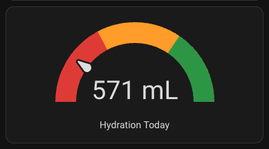

# LARQ Bottle — Home Assistant Integration



Adds hydration tracking from a LARQ smart bottle to Home Assistant.

**Sensors provided:**
| Entity | Description |
|--------|-------------|
| `sensor.larq_water_today` | Total water consumed today (mL) |
| `sensor.larq_last_drink` | Timestamp of last drink |
| `sensor.larq_daily_goal` | Daily hydration goal (mL) |
| `sensor.larq_battery` | Bottle battery level (%) via BLE |

---

## How it works

LARQ syncs hydration data to Firebase Realtime Database via the iOS app. This integration:
1. **BLE battery** — read directly from the bottle via Bluetooth on the HA host (every 5 min)
2. **Hydration data** — fetched from Firebase RTDB via a Mac-side script that pushes to HA's REST API (every 5 min via cron)

The Mac-side script is needed because Firebase token refresh only works reliably from macOS clients in this setup.

---

## Prerequisites

- Home Assistant OS on a host with a BLE adapter
- A Mac that is always on (or frequently on) on the same network as HA
- A LARQ smart bottle with the iOS app installed and syncing
- [Stream](https://www.proxyman.io/stream) (or any HTTPS proxy) to capture the Firebase refresh token

---

## Part 1 — Capture your Firebase credentials

You need to sniff your Firebase refresh token from the LARQ iOS app.

1. Install **Stream** (or Charles/mitmproxy) on your iPhone
2. Enable the HTTPS proxy and trust the certificate
3. Open the LARQ app and use it normally
4. In Stream, filter for `securetoken.googleapis.com/v1/token`
5. Copy from the response:
   - `refresh_token` → `firebase_refresh_token` in your config
   - `user_id` → `firebase_uid` in your config
6. From `firebaseremoteconfig.googleapis.com` request headers, copy:
   - `key=` URL param → `firebase_api_key`
7. Your RTDB URL is `https://<project-id>.firebaseio.com` — find `<project-id>` in the Firebase Remote Config request URL

---

## Part 2 — HA custom component (battery + daily goal)

1. Copy `custom_components/larq/` to your HA config directory:
   ```
   /config/custom_components/larq/
   ```

2. Copy `larq_battery_read.py` is already inside the component folder — it needs `bleak` installed:
   ```bash
   python3 -m venv /config/larq_venv2
   /config/larq_venv2/bin/pip install bleak
   ```

3. Add to `configuration.yaml`:
   ```yaml
   sensor:
     - platform: larq
   ```

4. Restart Home Assistant.

---

## Part 3 — Mac push script (hydration data)

1. Copy `larq_push.py` and `larq_config.example.json` to a folder on your Mac
2. Copy `larq_config.example.json` → `larq_config.json` and fill in your values:
   ```bash
   cp larq_config.example.json larq_config.json
   ```
3. Get a HA Long-Lived Access Token: **HA → Profile → Long-Lived Access Tokens**
4. Test the script:
   ```bash
   python3 larq_push.py
   ```
5. Set up a cron job to run every 5 minutes:
   ```bash
   (crontab -l 2>/dev/null; echo "*/5 * * * * /usr/bin/python3 /path/to/larq_push.py >> /tmp/larq_push.log 2>&1") | crontab -
   ```

---

## Dashboard card

Add a gauge card to your HA dashboard (Edit → Add Card → Manual):

```yaml
type: gauge
name: Hydration Today
entity: sensor.larq_water_today
min: 0
max: 2900
unit: mL
needle: true
severity:
  green: 2000
  yellow: 1000
  red: 0
```

---

## Notes

- Hydration data syncs from the bottle to Firebase via the LARQ iOS app — there may be a lag if the app hasn't synced recently
- The Firebase refresh token does not expire unless you sign out of the LARQ app or change your password
- BLE battery reading requires the bottle to be within range of the HA host's Bluetooth adapter
